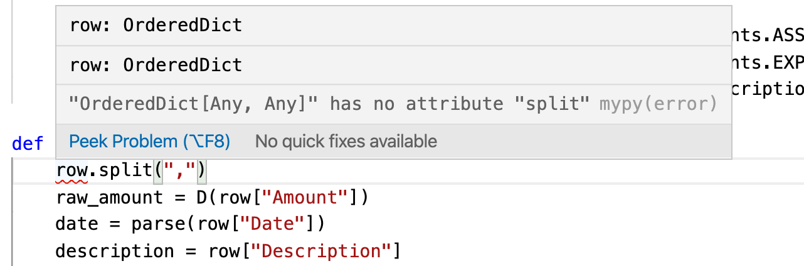
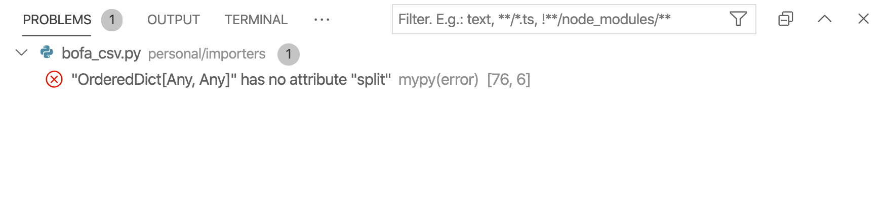

Types and functional programming have changed the way I think about the problems in the last 3 years. And the thing that keeps me from python is types. Types are helpful while evolving a project, helps carry around context as needed in the code context.

[mypy](http://mypy-lang.org) is what got me writing python the entire day today. And it was refreshing. Here is the simple use case of writing those optional types. I have spent the last two days learning what a Double Entry Accounting is (hey, never too late to learn). It has a learning curve but feels like it is worth the time and effort. I started with reading the documentation for [beancount](http://furius.ca/beancount/). 

Here is a simple function

```python
def parse_rent(row, meta):
    return ...
```

and here it is with types

```python
def parse_rent(row: OrderedDict, meta: dict) -> data.Transaction:
```

In the function with type signature, every time I come to change something within the function I don't have to go back to the call site and check what parameter types where being passed to it, sure we can write something like `row_ordered_dict`. But using a formal type like this allows us to use automated tools by mypy library.

The thing that makes this experience a delight is VS code python [extension](https://marketplace.visualstudio.com/items?itemName=ms-python.python) it is as easy as installing the plugin.



Or in the problems window



The great thing is, it is optional. And can exist in an isolated part of the codebase without disturbing the rest of codebase. Hopefully, this is going to make maintaining code easy and less time consuming.

